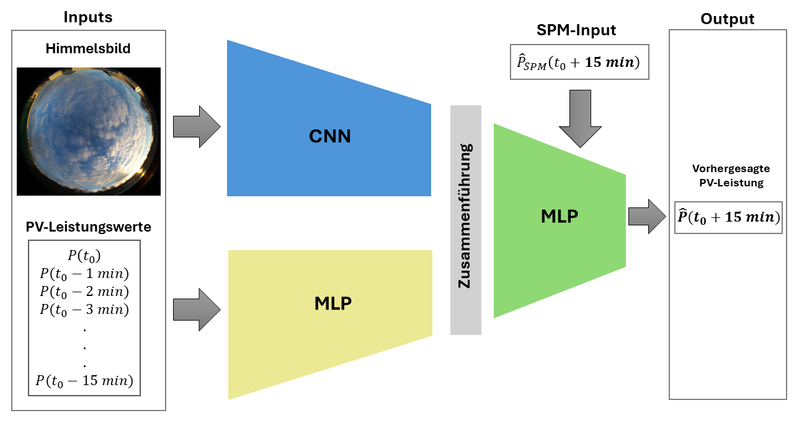
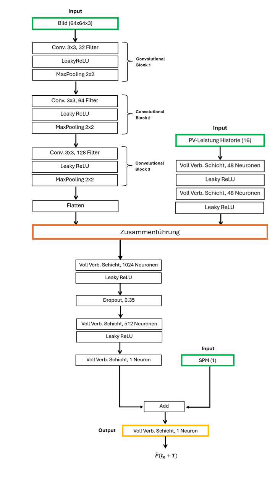

### Photovoltaic Short-term Power Forecasting using Deep Learning

This repository contains the code (and data) associated with my Bachelor's thesis on the development of a Deep-Learning model for short-term PV power forecasting. The project aims to address the challenges posed by the fluctuating availability of PV energy, particularly in the context of the planned extensive expansion of photovoltaic (PV) energy in Germany.

#### Overview
In this thesis, a Deep Learning (DL) model was developed for short-term PV power forecasting. The model, an end-to-end CNN-MLP hybrid network, takes inputs such as sky images, PV historical data, and the prediction value from the Smart Persistence Model (SPM) to generate future power values for a 15-minute forecast period.

*High-level overview of the model.*

#### Dataset Creation
A dataset comprising sky images and PV power values was created using cost-effective software and hardware components. Sky images were captured using a Raspberry Pi equipped with a wide-angle camera, resulting in acceptable data quality at a fraction of the cost of commercial sky imaging systems.

#### Model Training and Evaluation
The DL model was trained and evaluated on the created dataset. It achieved a Forecast Skill (FS) of 58.9% using the Root Mean Squared Error (RMSE) metric compared to the SPM benchmark model. This demonstrates that the DL model can provide more accurate power forecasts than the benchmark model.

*Disclaimer: For more detailed information about the achieved FS and evaluation metrics, please refer to the document provided in the Document Folder section.*

#### Conclusion
The findings suggest that the inclusion of sky images and SPM prediction values as model inputs significantly improves prediction accuracy.

#### Appendix

*Entire architecture of the Deep Learning model.*

