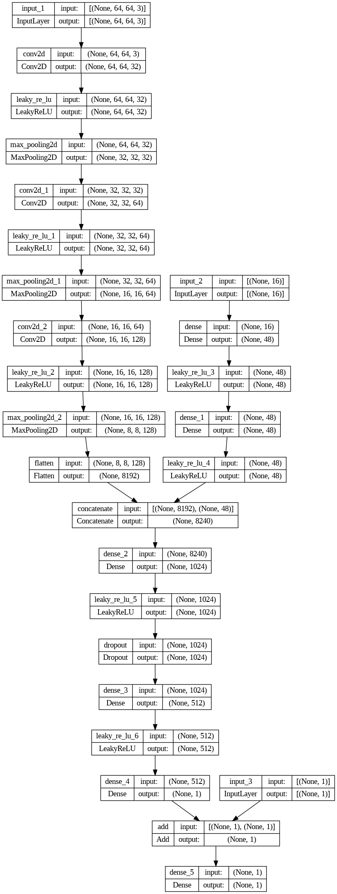

# Photovoltaic Short-term Power Forecasting using Deep Learning

This repository contains the code associated with my Bachelor's thesis on the development of a Deep Learning model for short-term PV power forecasting. The project aims to address the challenges posed by the fluctuating availability of PV energy, particularly in the context of the planned extensive expansion of photovoltaic (PV) energy in Germany.

## Overview
In this thesis, a Deep Learning (DL) model was developed for short-term PV power forecasting. The model, an end-to-end CNN-MLP hybrid network, takes inputs such as sky images, PV historical data, and the prediction value from the Smart Persistence Model (SPM) to generate future power values for a 15-minute forecast period.

*High-level overview of the model:*

## Dataset Creation
A dataset comprising sky images and PV power values was created using cost-effective software and hardware components. Sky images were captured using a Raspberry Pi equipped with a wide-angle camera at the Ostbayerische Technische Hochschule Regensburg, resulting in acceptable data quality at a fraction of the cost of commercial sky imaging systems.

## Model Training and Evaluation
A new hybrid Convolutional Neural Network (CNN) and Multi-Layer Perceptron (MLP) model was developed for this project. The CNN component processes the sky images to extract spatial features form the sky images, while the MLP component handles the time-series data from historical PV values and SPM predictions. This combined approach leverages both spatial and temporal information to enhance the accuracy of PV power forecasts.

The Deep Learning model was trained and evaluated on both the created dataset and the public SKIPP'D Benchmark dataset. Key evaluation metrics included the Root Mean Squared Error (RMSE) and the Forecast Skill (FS).

- **Custom Dataset:** The DL model achieved a Forecast Skill (FS) of 58.9% compared to the SPM benchmark model. 
- **SKIPP'D Benchmark Dataset:** On the public SKIPP'D Benchmark dataset, the model achieved a Forecast Skill (FS) of 24.2% compared to the SPM benchmark model. 

### Comparison with Related Literature
The results obtained from the DL model were compared with those from related studies. The model's performance demonstrated improvements in the measured Forecast Skill (FS). Models in the literature are often considered "state of the art" in PV power forecasting with FS values ranging from 10-20%.

## Conclusion
The findings suggest that the proposed Deep Learning forecast model is capable of predicting future PV power quite accurately. Especially the inclusion of Smart Persistence Model (SPM) prediction values as model input significantly improves prediction accuracy. This model holds potential for enhancing the efficiency of integrating an increasing number of PV installations into the power grid, addressing the challenges for grid operators.

## Appendix

*Entire architecture of the Deep Learning model:*

## Disclaimer

All statements and documents in this document are not to be considered as scientifically substantiated statements and are provided without warranty or guarantee of any kind. These pieces of information are provided for informational and inspirational purposes only and should not be interpreted as authoritative statements. Any actions taken based on this information are done at your own risk. No assurance is given for the accuracy, completeness, or timeliness of the information provided.
