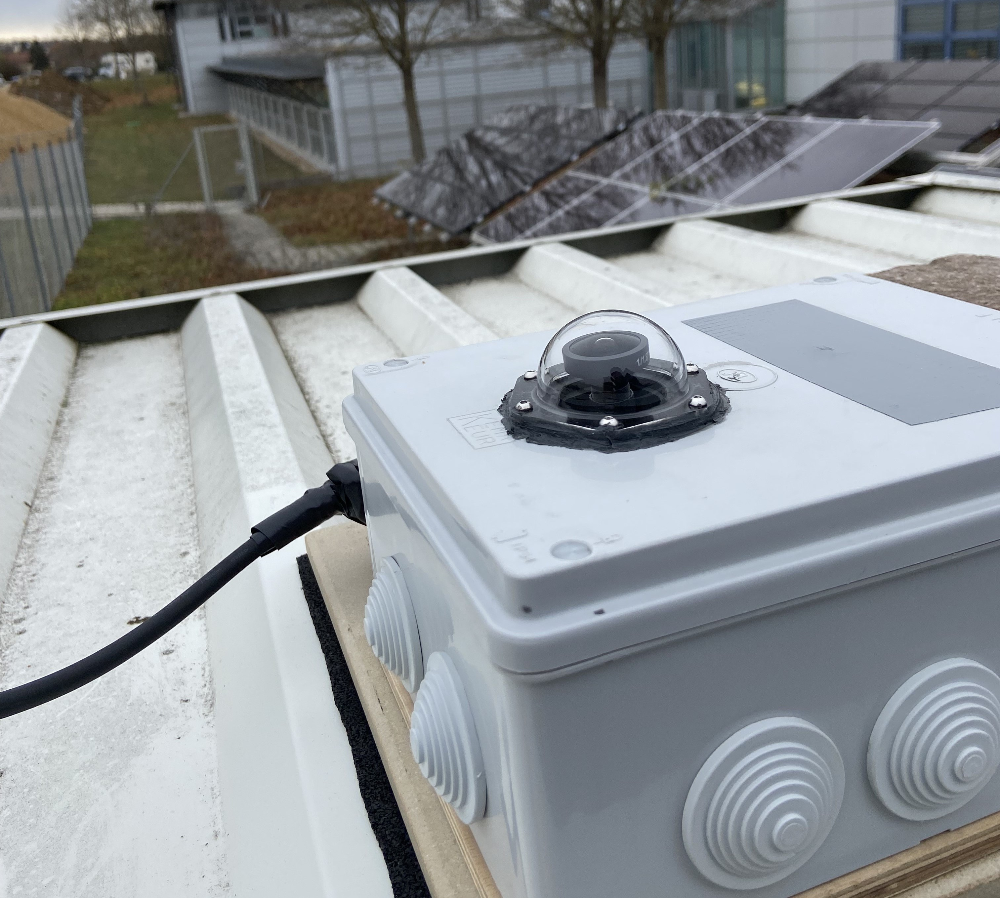

### Dataset Creation

To train DL models effectively, it's crucial to curate suitable data. This section outlines the creation of a dataset comprising sky images and PV power values using cost-effective software and hardware components.

#### Data Collection Design
Sky images were captured using a wide-angle lens and a Sony IMX477 image sensor. A Raspberry Pi 4 with custom software controlled the image capture process.

The dataset was collected from November 13, 2023, to January 12, 2024, with images captured every minute from 6 am to 6 pm. Power values were stored at five-minute intervals by the PV system's inverter, necessitating linear interpolation to achieve one-minute resolution for label data.

The scripts and further programming information for the Raspberry Pi are available in the designated folders.

### Tabelle A.1: List of used hardware components. (As of 24.02.2024)

| Components                          | Price [Euro] | Link                                                                                   |
|-------------------------------------|--------------|----------------------------------------------------------------------------------------|
| Arducam 12MP Mini Camera Module     | 84.99        | [Link](https://eu.robotshop.com/de/products/arducam-12mp-imx477-mini-high-quality-camera-module-raspberry-pi) |
| Raspberry Pi 4 Model B              | 60.50        | [Link](https://www.berrybase.de/raspberry-pi-4-computer-modell-b-4gb-ram)             |
| 8MP Fisheye Lens                    | 51.95        | [Link](https://amzn.eu/d/dibuxKc)                                                       |
| Waterproof Dome                     | 35.00        | [Link](https://thepihut.com/products/entaniya-waterproof-case-for-raspberry-pi-camera-modules) |
| 128GB Memory Card                   | 15.43        | [Link](https://amzn.eu/d/gxpBCjP)                                                       |
| Heating Foil 1.5W                   | 14.99        | [Link](https://www.conrad.de/de/p/thermo-tech-polyester-heizfolie-selbstklebend-5-v-dc-5-v-ac-1-5-w-l-x-b-70-mm-x-70-mm-1216592.html) |
| Waterproof Case                     | 14.59        | [Link](https://amzn.eu/d/cFuG2HJ)                                                       |
| Accessories                         | 20.00        | /                                                                                      |
| **Total**                           | **297.45**   |                                                                                         |

#### Key Takeaways

- **Challenges in Data Collection**: Unexpected technical problems, unplanned maintenance, and adverse weather conditions posed significant challenges during data collection, leading to gaps and data inconsistencies. For future work, attention should be paid to adequate measures for error prevention, both in software and hardware, such as backup system checks and storage, as well as grounding/shielding of the CSI camera cable.
- **Imbalance in Weather Conditions**: The dataset lacks balance between good and bad weather conditions, with a higher prevalence of data points representing adverse weather conditions compared to optimal conditions. In future work, emphasis should be placed on a relatively long data collection period to achieve more robust results, and attention should be given to diverse weather conditions.
- **Problem with the collected PV Power Data**: Due to software limitations of the inverter, data could only be logged at a 5-minute frequency, which was interpolated to achieve a 1-minute resolution. However, it is not advisable for future work; it is recommended to use a power meter with a 1-minute sampling frequency!
  
#### Data Preparation

Data preparation is a crucial step in preparing for DL model training. The goal is to remove faulty images and label data and prepare suitable inputs for the DL model.

- **Image Distortion**: Wide-angle camera lenses cause distortion in images due to the fisheye effect. Despite this distortion, no correction was applied during data preparation, as it was deemed unnecessary. (This hypothesis needs to be tested.)
- **Image Resolution**: Images were downscaled to 64×64 pixels during data preparation, enhancing model training efficiency and generalization.
- **Data Normalization and Zero-Centering**: Normalization and zero-centering of image data were performed to improve CNN processing and feature learning robustness.
- **Limited Augmentation**: Traditional image augmentation techniques such as mirroring, rotation, and random cropping were deemed unhelpful for this dataset, based on prior research [1].

*Note: It is hoped that these insights will contribute to the development of cost-effective sky imaging systems, thereby advancing research in the field.*

### Sources

[1] Yuhao Nie, Ahmed S. Zamzam, Adam Brandt, "Resampling and data augmentation for short-term PV output prediction based on an imbalanced sky images dataset using convolutional neural networks," Solar Energy, Volume 224, 2021, Pages 341-354, ISSN 0038-092X, [DOI: 10.1016/j.solener.2021.05.095](https://doi.org/10.1016/j.solener.2021.05.095). [Link](https://www.sciencedirect.com/science/article/pii/S0038092X21004795)

### Disclaimer

All statements and documents in this document are not to be considered as scientifically substantiated statements and are provided without warranty or guarantee of any kind. These pieces of information are provided for informational and inspirational purposes only and should not be interpreted as authoritative statements. Any actions taken based on this information are done at your own risk. No assurance is given for the accuracy, completeness, or timeliness of the information provided. 
